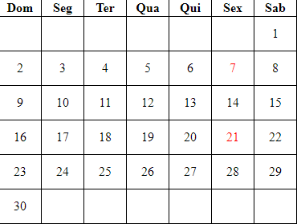

# calendario
[calendario](#calendario)
[descrição](#descrição)
[introdução](#introdução)
[funcionalidade](#funcionalidade)
[tecnologias.utilizadas](#tecnologias utilizadas)
[fontes.utilizadas](#fontes utilizadas)
[autores](#autores)
# Calendario
 
 
